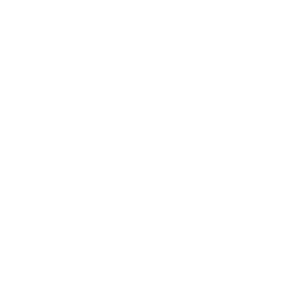

#

Pro DB kit enables teams to manage database access without involving DB Admins / Devops / IT teams. It allows developers and their managers ( Team Lead, Engineering Managers etc. ) to grant access to the databases they have access to without any intervention from any of the teams administering databases. The goal is to reduce the dependency on Devops / IT teams for granting access to databases and thus enabling them to channelise their energies to more productive tasks at the same time the developers can get access to the systems they need to without going through the vicious cycle of approvals and escalations.

 

# Table of Content

1. [Demo](#demo)
2. [Installation](#installation)
3. [Technology Stack](#technology-stack)
4. [Authors](#authors)
5. [License](#license)

 

# Demo

[Live Demo](https://n8-prodbkit-epsilon-8.vercel.app/)

 

Please Note:

1. We recommend using this app in Google Chrome
2. Use the app on Laptop/desktop only as of now.
3. We are using Auth0 for authentication, so for recruiter login, please don't use Safari, as it blocks third-party cookies.

 
Test Credentials:

- For Admin
  - Email: test@user.io
  - Password: test-user@pass

 

# Installation

- Fork or directly clone this repository to your local machine
- Use the `npm install` command to install dependencies
- Once the dependencies are finished installing, use the `npm start` command inside the root directory to open the app in your local browser of choice

 

# Technology Stack

We tried to use a completely modern tech stack while testing out some new technologies that we had never used before. This resulted in a fast, performant, and easily-extensible web app that should be fairly future-proof for the coming next several years. We used:

- [Ant design](https://ant.design/)
- [Redux toolkit](https://redux-toolkit.js.org/)
- [Lodash](https://lodash.com/)
- [Axios](https://axios-http.com/docs/intro)
- [React Query](https://react-query.tanstack.com/)

 

# Authors

- [Saurav Arora](hhttps://github.com/sauravarora041294)
- [Abhishek Khanna](https://github.com/assaultkoder95)

 

# License

[MIT](https://opensource.org/licenses/MIT)
